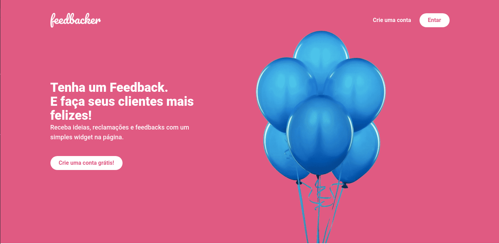

<h1 align="center">
  
</h1>

<p align="center">
  <a href="#computer-project">Project</a>&nbsp;&nbsp;&nbsp;|&nbsp;&nbsp;&nbsp;
  <a href="#rocket-technologies">Technologies</a>&nbsp;&nbsp;&nbsp;|&nbsp;&nbsp;&nbsp;
  <a href="#tada-features">Features</a>&nbsp;&nbsp;&nbsp;|&nbsp;&nbsp;&nbsp;
  <a href="#tada-layout">Layout</a>&nbsp;&nbsp;&nbsp;|&nbsp;&nbsp;&nbsp;
  <a href="#construction_worker-how-to-run">How to run</a>&nbsp;&nbsp;&nbsp;|&nbsp;&nbsp;&nbsp;
  <a href="#closed_book-license">License</a>
</p>

<p>
  
</p>

## :computer: Project

<strong> You can view the app site here:</strong>
coming soon

## :rocket: Technologies

* [Vue.js](https://vuejs.org/)

## :tada: Features

coming soon

## :triangular_ruler: Layout

## :construction_worker: How to run

### Run Web Project

```bash
# Go to web folder
$ cd nlw3-happy/web

# Install Dependencies
$ yarn install

# Run Aplication
$ yarn serve

```


## :closed_book: License
This project is under the MIT license. See the file [LICENSE](LICENSE.md) for more details.

---
Made with ♥ by Anna Laura - [alauraivani](https://github.com/alauraivani)